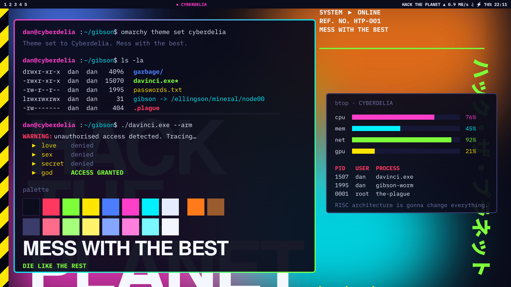

# CYBERDELIA

```
  >>> ACCESSING ... GIBSON MAINFRAME
  >>> REF. NO. 1995/CD-06        PAL 625/50
  >>> USER: ZERO COOL            STATUS: *** UNAUTHORISED ***
  >>> LOADING THEME ..........  [ OK ]
```

*Hack the planet.* This is an [Omarchy](https://omarchy.org) theme for people
who think the 3D file browser in *Hackers* (1995) was a reasonable idea and the
world just wasn't ready. Picture a Massive Attack sleeve left face-down on a
Designers Republic light table in a club called Cyberdelia: out-of-focus neon
colour fields, block Helvetica headlines, hazard stripes, chevrons, numerals the
size of a bus, katakana nobody asked for, and "REF. NO." meta text on
everything. Deliberately garish. Pre-pre-Frutiger Aero. It's in the place where
I put that thing that time.



## JACK IN

```bash
omarchy theme install https://github.com/WeaselBiggs/omarchy-cyberdelia.git
```

One line. No modem noises, but you're welcome to make them yourself. This clones
the repo into `~/.config/omarchy/themes/cyberdelia` and switches to it; from
then on it's in the theme menu like any other theme, except louder.

## THE PALETTE (RISC IS GOOD)

| Role | Hex | Codename |
| --- | --- | --- |
| background | `#0b0c1c` | CRT off, room dark, 3 a.m. |
| foreground | `#e6ecff` | phosphor |
| accent / magenta | `#ff3ec9` | Acid Burn |
| cyan | `#00f0ff` | cathode |
| acid green | `#7dff3a` | the good kind of virus |
| hazard yellow | `#ffe600` | DO NOT CROSS |
| orange | `#ff7a1a` | Protection-era sodium glow |
| blue | `#4d7dff` | Blue Lines |
| red | `#ff3860` | Crash and Burn |

The focused window gets the full Cyberdelia lightshow: a magenta into cyan into
acid green border gradient. It's one line in `colors.toml`, and Omarchy carries
it through to Hyprland, the bar and the notifications, so you always know which
window you're about to type the wrong password into.

## THE WALLPAPERS

Six of them in `backgrounds/`, rendered at 3840x2560 (3:2), one per line you
still quote when nobody's listening:

1. **Hack the Planet** — out-of-focus neon, block-justified Helvetica
2. **Gibson** — the mainframe, the towers, the scanlines
3. **Crash and Burn** — hazard stripes, chevrons, things going wrong on purpose
4. **Zero Cool / 1507** — one number, very large. 1,507 systems in one day.
5. **Acid Burn** — magenta field, orbital roundel, hazard sash
6. **Mess With the Best** — smeared test-card bars under scanlines. Die like the rest.

The four most common passwords are love, sex, secret and god. Please don't use
any of them on this machine.

## THE GENERATOR (or: it's a UNIX system, I know this)

The wallpapers aren't painted, they're *compiled*. `gen-wallpapers.py` writes
each one as an SVG and hands it to `rsvg-convert`:

```bash
python3 gen-wallpapers.py backgrounds/            # scratch SVGs go to a temp dir
python3 gen-wallpapers.py backgrounds/ /tmp/svg/  # or keep the SVGs to hand-edit
```

Needs `python3` and `librsvg` (`rsvg-convert`). The SVGs ask for these fonts by
name and fall back to whatever fontconfig hands them: Nimbus Sans, Nimbus Sans
Narrow, URW Gothic (all in `gsfonts`), Noto Sans Mono, and Noto Sans CJK JP for
the katakana. Each wallpaper is a function, `w1()` through `w6()`. Change the
colour constants at the top and you can re-tint the whole club. Type quickly and
look worried while you do it; it helps.

`preview.png` is the theme-menu card. Its source lives in `preview-src/`, a
`preview.svg` laid over `bg-preview.png`. Rebuild it with:

```bash
cd preview-src && rsvg-convert -w 1800 -h 1012 -o ../preview.png preview.svg
```

## FILE MANIFEST

- `colors.toml` — the palette Omarchy templates every app config from
- `icons.theme` — icon theme name (Yaru-magenta-dark)
- `backgrounds/` — the six wallpapers
- `preview.png`, `unlock.png` — theme-menu card and lock-screen logo
- `preview-unlock.png` — 1920x1080 lock-screen preview, the logo over the password box
- `gen-wallpapers.py` — the wallpaper compiler
- `preview-src/` — preview card source
- `garbage file` — deleted. You didn't see it.

## RGB

This theme ships no `keyboard.rgb`, so its `accent` from `colors.toml` feeds the `openrgb-theme` hook below, which paints every
OpenRGB device (RAM, GPU, motherboard ARGB headers) and every openrazer
device in the theme's colour on theme-set and post-boot. It is not part of
the theme itself; Omarchy does not run scripts shipped inside a theme. To get
it on another machine, install `openrgb` (and `openrazer-daemon` if there is
Razer kit), save the script as `openrgb-theme`, then:

```bash
omarchy hook install theme-set openrgb-theme
omarchy hook install post-boot openrgb-theme
omarchy theme set "Cyberdelia"   # re-apply to paint
```

Colour source, in order: `~/.config/omarchy/openrgb.color` if it exists
(a global override, `#000000` for lights off), the theme's `keyboard.rgb`,
else `accent` from `colors.toml`. Progress is logged to
`~/.local/state/omarchy/openrgb-theme.log`.

```bash
#!/bin/bash
# Paint every OpenRGB-detected device (RAM, GPU, motherboard ARGB headers...)
# and every openrazer device (Razer mouse/keyboard)
# in the current Omarchy theme's colour. Runs on theme-set and post-boot.
#
# Colour source, in order: the theme's keyboard.rgb if it has one, otherwise
# `accent` from the theme's colors.toml. Override for every theme by putting a
# hex colour in ~/.config/omarchy/openrgb.color (e.g. "#000000" for lights off).
#
# Every device that offers a Static mode gets it; the rest (Corsair DDR5) get
# Direct, which holds until the next power cycle, hence the post-boot run.
#
# OpenRGB re-detects hardware on every CLI call, and that detection is flaky
# (the GPU's i2c bus sometimes answers garbage), so device numbers can shift
# between calls. Never address devices by number: apply each mode to *all*
# devices and let OpenRGB skip the ones that lack it, and retry a pass whose
# detection logged an error. Progress goes to $LOG.

command -v openrgb >/dev/null || command -v openrazer-daemon >/dev/null || exit 0

THEME=$HOME/.local/state/omarchy/current/theme
OVERRIDE=$HOME/.config/omarchy/openrgb.color
LOG=$HOME/.local/state/omarchy/openrgb-theme.log

hex=""
[[ -f $OVERRIDE ]] && hex=$(<"$OVERRIDE")
[[ $hex =~ ^#?[0-9A-Fa-f]{6}$ ]] || { [[ -f $THEME/keyboard.rgb ]] && hex=$(<"$THEME/keyboard.rgb"); }
[[ $hex =~ ^#?[0-9A-Fa-f]{6}$ ]] || hex=$(sed -n 's/^accent *= *"\(#[0-9A-Fa-f]\{6\}\)".*/\1/p' "$THEME/colors.toml" 2>/dev/null)
hex=${hex#\#}
[[ $hex =~ ^[0-9A-Fa-f]{6}$ ]] || exit 0

log() { printf '%s %s\n' "$(date '+%F %T')" "$*"; }

# Razer devices (openrazer, via D-Bus; the daemon is bus-activated).
razer() {
  command -v openrazer-daemon >/dev/null || return 0
  python3 - "$hex" <<'PY'
import sys
hexc = sys.argv[1]
r, g, b = (int(hexc[i:i+2], 16) for i in (0, 2, 4))
try:
    from openrazer.client import DeviceManager
    dm = DeviceManager()
    dm.sync_effects = False
    for d in dm.devices:
        if d.has("lighting_static"):
            d.fx.static(r, g, b)
        for zone in ("logo", "scroll_wheel", "left", "right", "backlight"):
            z = getattr(d.fx.misc, zone, None)
            if z is not None and d.has(f"lighting_{zone}_static"):
                z.static(r, g, b)
        print("razer:", d.name, "->", hexc)
except Exception as e:
    print("razer: failed:", e)
PY
}

# One OpenRGB pass: give $1 mode + the colour to every device that has it.
# Retried when OpenRGB's own detection log reports an error (a device that
# failed to detect is simply absent, so it would silently keep its old colour).
openrgb_pass() {
  local mode=$1 attempt out
  for attempt in 1 2 3; do
    out=$(openrgb --noautoconnect -v -m "$mode" -c "$hex" 2>&1)
    if grep -q '|ERROR:' <<<"$out"; then
      log "openrgb $mode: attempt $attempt hit a detection error:"
      grep '|ERROR:' <<<"$out"
      sleep 2
      continue
    fi
    log "openrgb $mode: applied ($(grep -c 'Registering RGB controller' <<<"$out") devices detected)"
    grep -E '^Error:' <<<"$out" | grep -v 'not available for device' # expected skips are not news
    return 0
  done
  log "openrgb $mode: giving up after $attempt attempts"
  return 1
}

apply() {
  command -v openrgb >/dev/null || return 0
  # Direct first, Static second: a device with both ends up in Static, which
  # survives the CLI process exiting; Direct-only devices keep Direct.
  openrgb_pass direct
  sleep 1
  openrgb_pass static
}

# Detection takes a few seconds; don't hold up the theme switch, and never
# let two runs fight over the i2c bus.
(
  flock -w 30 9 || exit 0
  {
    log "start: theme=$(cat "$HOME/.local/state/omarchy/current/theme.name" 2>/dev/null) colour=#$hex"
    razer
    apply
    log "done"
  } >"$LOG" 2>&1
) 9>"${XDG_RUNTIME_DIR:-/tmp}/openrgb-theme.lock" &
disown
```

## LICENCE

MIT. Fonts and the icon theme are not included and carry their own licences.
There is no Secret Service involvement at this time.

```
  >>> CONNECTION TERMINATED.        MESS WITH THE BEST.
```
